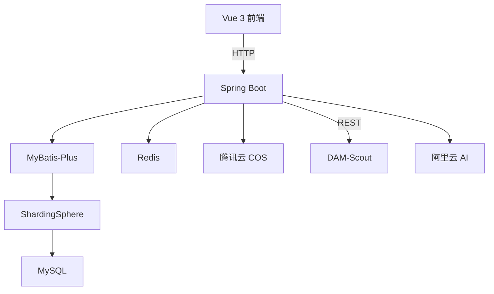
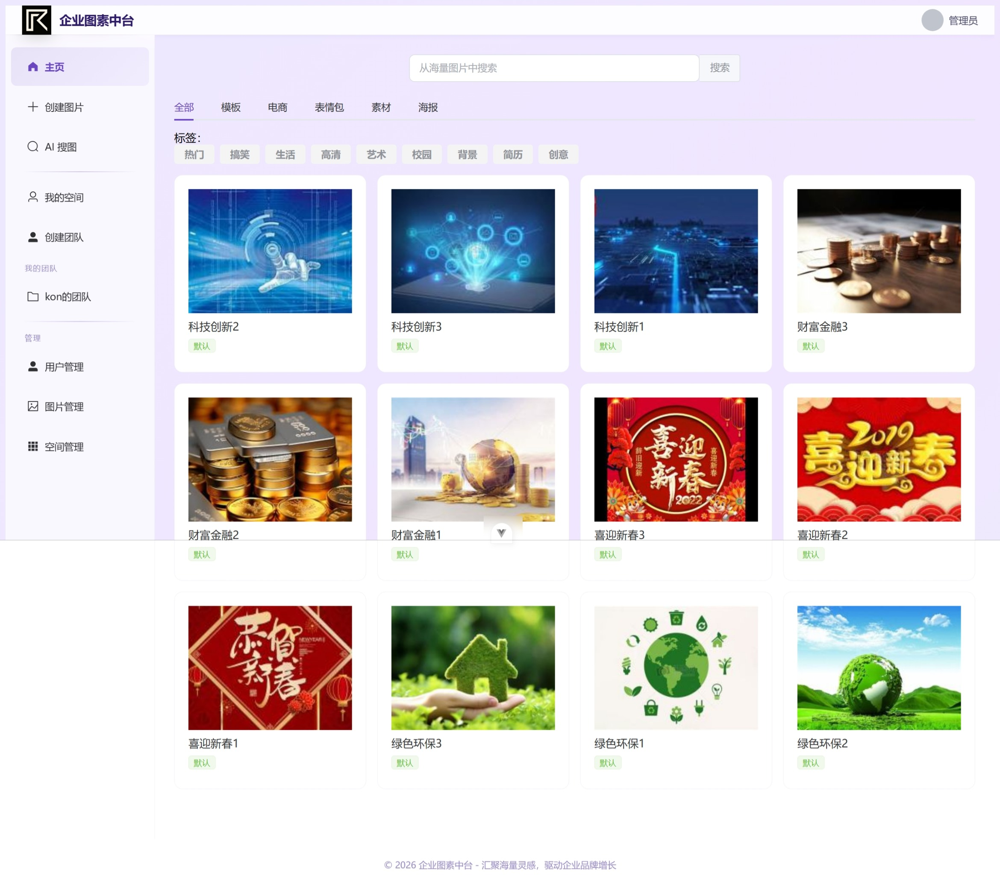
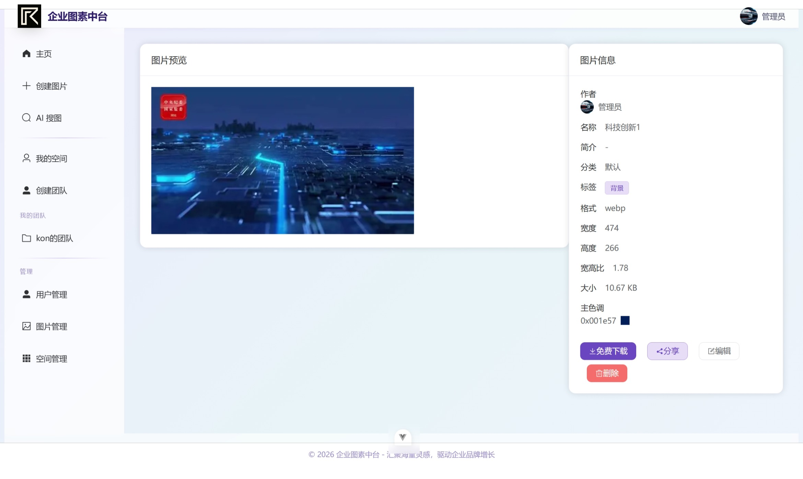
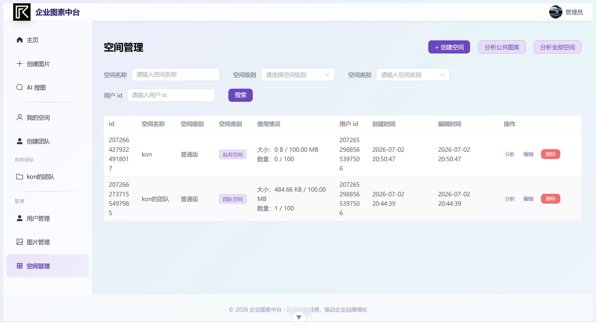
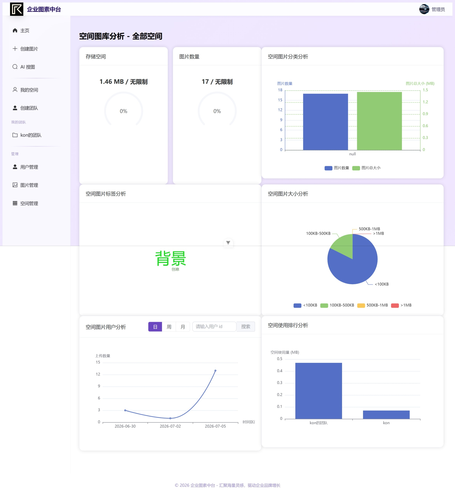

# DAM-HUB 企业图素中台

企业级图片素材平台，提供素材上传、智能检索、团队协作和 AI 策展能力，帮助企业统一管理品牌视觉资产。


---

## 系统架构



## 功能特性

### 图片管理
- 图片上传（本地文件 / URL 导入）、编辑、删除、批量导入
- 按颜色、关键词、分类、标签多维度搜索
- 图片审核机制，管理员审核保障内容质量
- 自动提取图片元信息（宽高、格式、主色调）

### 团队空间
- 私有空间 + 团队空间两种模式
- 成员管理：管理员 / 编辑者 / 查看者三级权限
- 空间存储额度管理，按量计费

### 数据分析
- 空间维度统计：分类分布、标签词云、存储用量
- 用户维度统计：上传趋势、活跃度分析
- ECharts 可视化图表

### AI 能力
- **AI 搜图**：自然语言描述 → RAG 语义检索 → 智能策展方案（需配合 [DAM-Scout](https://github.com/konlue/dam-scout) 服务）
- **AI 扩图**：基于阿里云 AI 的图片智能扩展
- **以图搜图**：上传图片查找相似素材

### 用户系统
- 注册登录、角色权限（普通用户 / 管理员）
- VIP 会员体系、兑换码机制
- 个人中心：头像、用户名、简介、密码管理

## 服务访问

| 服务 | 地址 | 说明 |
|------|------|------|
| 前端页面 | http://localhost:5173 | Vue 开发服务器 |
| 后端 API | http://localhost:8123/api | Spring Boot 接口 |
| API 文档 | http://localhost:8123/api/doc.html | Knife4j 接口文档 |
| AI 策展服务 | http://localhost:8000/docs | DAM-Scout Swagger 文档 |

## 快速启动

### 环境要求

- JDK 17+
- Node.js 18+
- MySQL 5.7+
- Redis 6+

### 后端

```bash
# 克隆项目
git clone https://github.com/konlue/dam-hub.git

# 创建数据库
mysql -u root -p -e "CREATE DATABASE dam_picture DEFAULT CHARACTER SET utf8mb4;"

# 修改配置
# 编辑 dam-hub-backend/src/main/resources/application-dev.yml
# 配置数据库连接、Redis、腾讯云 COS 等

# 启动
cd dam-hub-backend
mvn spring-boot:run
```

### 前端

```bash
cd dam-hub-frontend

# 安装依赖
npm install

# 启动开发服务器
npm run dev

# 构建生产版本
npm run build
```

## 项目结构

```
dam-hub/
├── dam-hub-backend/                # 后端 Spring Boot 项目
│   ├── controller/                 # 接口层
│   ├── service/                    # 业务层
│   ├── mapper/                     # 数据访问层
│   ├── model/                      # 实体 & DTO & VO
│   ├── manager/                    # 第三方服务封装（COS、AI、鉴权）
│   ├── config/                     # 配置类
│   └── resources/
│       └── application.yml         # 应用配置
│
└── dam-hub-frontend/               # 前端 Vue 3 项目
    ├── src/
    │   ├── api/                    # 接口调用（自动生成）
    │   ├── components/             # 公共组件
    │   ├── pages/                  # 页面组件
    │   ├── stores/                 # Pinia 状态管理
    │   ├── router/                 # 路由配置
    │   └── layouts/                # 布局组件
    └── package.json
```

## 效果展示

**首页**



**图片详情**



**空间管理**



**空间分析**



## 相关项目

- [DAM-Scout](https://github.com/konlue/dam-scout) — AI 智能素材策展助手（RAG + LangGraph）

## 许可证

本项目仅供交流学习使用。
